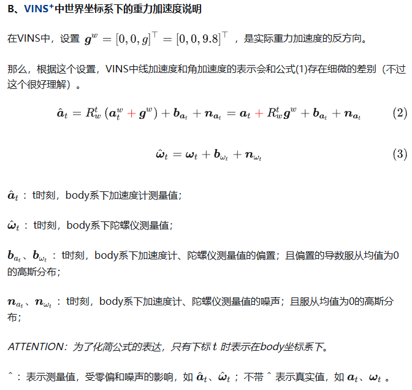
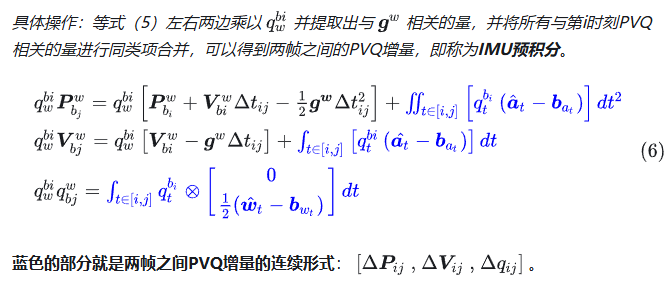
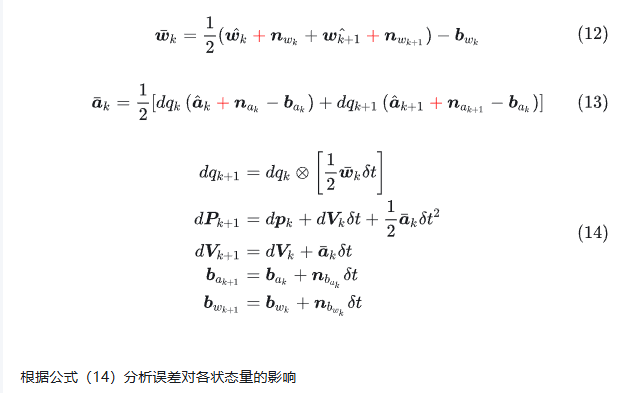
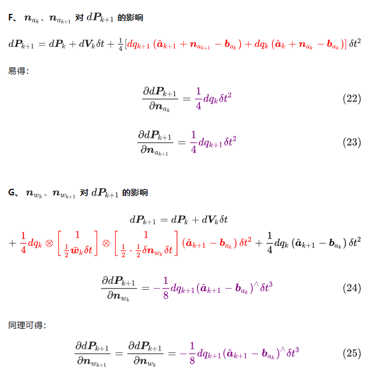

# imu预积分

[之前的imu预积分笔记](../imu_and_gnss/pre_integration_flow.md)

[ESKF中IMU预积分代码实现逻辑](../imu_and_gnss/monmo_code_pre_integration_flow.md)

[根据代码重新整理逻辑与ESKF版本对比](../imu_and_gnss/imu_preintegration_review.md)

## imu

当imu静止时，加速度测量值为-g；当imu自由落体时，加速度测量值为0。

常用数学性质


VINS中世界坐标系下的重力加速度说明



## 预积分

因为IMU的频率远远快于相机的频率，所以相邻两幅图像间会有多个IMU数据。为了通过IMU得到第k帧和第k+1帧之间的位置P、速度V和姿态Q(四元数表示)变化，需要将相邻两帧之间的IMU数据进行积分


预积分能处理哪些场景

1. 消除第i时刻，也就是上一帧的PVQ值对IMU积分的影响
2. 在零偏发生变化的时候，通过修正而不是重新计算，来调整预积分的值

### 预积分的增量形式

增量的连续形式



vins-mono采用了中值积分的离散形式


在零偏固定的假设下推导噪声模型

### 误差递推




## 误差（噪声）模型对各状态量的影响





## 代码

VINS中与IMU预积分相关integration_base.h文件进行注释

```cpp
    class IntegrationBase
{
  public:
    IntegrationBase() = delete;
    IntegrationBase(const Eigen::Vector3d &_acc_0, const Eigen::Vector3d &_gyr_0,
                    const Eigen::Vector3d &_linearized_ba, const Eigen::Vector3d &_linearized_bg)
        : acc_0{_acc_0}, gyr_0{_gyr_0}, linearized_acc{_acc_0}, linearized_gyr{_gyr_0},
          linearized_ba{_linearized_ba}, linearized_bg{_linearized_bg},
            jacobian{Eigen::Matrix<double, 15, 15>::Identity()}, covariance{Eigen::Matrix<double, 15, 15>::Zero()},
          sum_dt{0.0}, delta_p{Eigen::Vector3d::Zero()}, delta_q{Eigen::Quaterniond::Identity()}, delta_v{Eigen::Vector3d::Zero()}

    {
        noise = Eigen::Matrix<double, 18, 18>::Zero();
        noise.block<3, 3>(0, 0) =  (ACC_N * ACC_N) * Eigen::Matrix3d::Identity();
        noise.block<3, 3>(3, 3) =  (GYR_N * GYR_N) * Eigen::Matrix3d::Identity();
        noise.block<3, 3>(6, 6) =  (ACC_N * ACC_N) * Eigen::Matrix3d::Identity();
        noise.block<3, 3>(9, 9) =  (GYR_N * GYR_N) * Eigen::Matrix3d::Identity();
        noise.block<3, 3>(12, 12) =  (ACC_W * ACC_W) * Eigen::Matrix3d::Identity();
        noise.block<3, 3>(15, 15) =  (GYR_W * GYR_W) * Eigen::Matrix3d::Identity();
    }

    /**
     * @brief 记录用于IMU积分的数据；并调用propagate()函数进行预积分计算
    */
    void push_back(double dt, const Eigen::Vector3d &acc, const Eigen::Vector3d &gyr)
    {
        dt_buf.push_back(dt);
        acc_buf.push_back(acc);
        gyr_buf.push_back(gyr);
        propagate(dt, acc, gyr);        // 进行IMU积分计算
    }

    /**
     * @brief IMU的加速度和角速度偏置发生改变，那么需要更新IMU积分的值
     * 
     * @param _linearized_ba 输入的ba
     * @param _linearized_bg 输入的bg
     * @return ** void 
     */
    void repropagate(const Eigen::Vector3d &_linearized_ba, const Eigen::Vector3d &_linearized_bg)
    {
        sum_dt = 0.0;
        acc_0 = linearized_acc;
        gyr_0 = linearized_gyr;
        delta_p.setZero();
        delta_q.setIdentity();
        delta_v.setZero();
        linearized_ba = _linearized_ba;
        linearized_bg = _linearized_bg;
        jacobian.setIdentity();
        covariance.setZero();
        // 更新当前滑窗中的IMU积分即可
        for (int i = 0; i < static_cast<int>(dt_buf.size()); i++)
            propagate(dt_buf[i], acc_buf[i], gyr_buf[i]);
    }

    /**
     * @brief 中值法计算IMU预积分
     * ATTENTION 注意各个量更新的顺序
     * @param[in] _dt 两个IMU数据之间的时间间隔
     * @param[in&out] _acc_0、_gyr_0；_acc_1、_gyr_1 上一时刻和当前时刻加速度和角加速度的值
     * @param[in&out] delta_p、delta_q、delta_v是从上一图像帧到上一时刻的IMU积分值
     * @param[in&out] linearized_ba、linearized_bg 上一时刻的偏置ba、bg
     * @param[in&out] result_delta_p、result_delta_q、result_delta_v 从上一图像帧到当前时刻的IMU积分值
     * @param[in&out]  result_linearized_ba、result_linearized_bg 当前时刻的偏置ba、bg
     * @param[in] update_jacobian 是否进行雅可比的更新
    */
    void midPointIntegration(double _dt, 
                            const Eigen::Vector3d &_acc_0, const Eigen::Vector3d &_gyr_0,
                            const Eigen::Vector3d &_acc_1, const Eigen::Vector3d &_gyr_1,
                            const Eigen::Vector3d &delta_p, const Eigen::Quaterniond &delta_q, const Eigen::Vector3d &delta_v,
                            const Eigen::Vector3d &linearized_ba, const Eigen::Vector3d &linearized_bg,
                            Eigen::Vector3d &result_delta_p, Eigen::Quaterniond &result_delta_q, Eigen::Vector3d &result_delta_v,
                            Eigen::Vector3d &result_linearized_ba, Eigen::Vector3d &result_linearized_bg, bool update_jacobian)
    {
        //ROS_INFO("midpoint integration");
        Vector3d un_acc_0 = delta_q * (_acc_0 - linearized_ba);                     // a = a^ - ba
        Vector3d un_gyr = 0.5 * (_gyr_0 + _gyr_1) - linearized_bg;                  // 两个w(角加速度)相加平均后的值 = 0.5*(w_i + w_i+1) - bw_i；其中认为相邻时刻的偏置在极短的时间内是不变的
        // delta_q = 上上时刻与上一时刻的相对旋转
        // Quaterniond(1, un_gyr(0) * _dt / 2, un_gyr(1) * _dt / 2, un_gyr(2) * _dt / 2) = 上一时刻与当前时刻的相对旋转
        result_delta_q = delta_q * Quaterniond(1, un_gyr(0) * _dt / 2, un_gyr(1) * _dt / 2, un_gyr(2) * _dt / 2);
        Vector3d un_acc_1 = result_delta_q * (_acc_1 - linearized_ba);        // 使用更新后的result_delta_q将i+1时刻的加速度旋转到世界坐标系
        Vector3d un_acc = 0.5 * (un_acc_0 + un_acc_1);                                      // 上一时刻和当前时刻平均后的加速度值
        result_delta_p = delta_p + delta_v * _dt + 0.5 * un_acc * _dt * _dt;
        result_delta_v = delta_v + un_acc * _dt;
        result_linearized_ba = linearized_ba;
        result_linearized_bg = linearized_bg;         
        
        // 这里的F、V he和公式推导都能相对应
        if(update_jacobian)
        {
            Vector3d w_x = 0.5 * (_gyr_0 + _gyr_1) - linearized_bg;
            Vector3d a_0_x = _acc_0 - linearized_ba;
            Vector3d a_1_x = _acc_1 - linearized_ba;
            Matrix3d R_w_x, R_a_0_x, R_a_1_x;

            R_w_x<<0, -w_x(2), w_x(1),
                w_x(2), 0, -w_x(0),
                -w_x(1), w_x(0), 0;
            R_a_0_x<<0, -a_0_x(2), a_0_x(1),
                a_0_x(2), 0, -a_0_x(0),
                -a_0_x(1), a_0_x(0), 0;
            R_a_1_x<<0, -a_1_x(2), a_1_x(1),
                a_1_x(2), 0, -a_1_x(0),
                -a_1_x(1), a_1_x(0), 0;

            MatrixXd F = MatrixXd::Zero(15, 15);
            F.block<3, 3>(0, 0) = Matrix3d::Identity();
            F.block<3, 3>(0, 3) = -0.25 * delta_q.toRotationMatrix() * R_a_0_x * _dt * _dt + 
                                  -0.25 * result_delta_q.toRotationMatrix() * R_a_1_x * (Matrix3d::Identity() - R_w_x * _dt) * _dt * _dt;
            F.block<3, 3>(0, 6) = MatrixXd::Identity(3,3) * _dt;
            F.block<3, 3>(0, 9) = -0.25 * (delta_q.toRotationMatrix() + result_delta_q.toRotationMatrix()) * _dt * _dt;
            F.block<3, 3>(0, 12) = -0.25 * result_delta_q.toRotationMatrix() * R_a_1_x * _dt * _dt * -_dt;
            F.block<3, 3>(3, 3) = Matrix3d::Identity() - R_w_x * _dt;
            F.block<3, 3>(3, 12) = -1.0 * MatrixXd::Identity(3,3) * _dt;
            F.block<3, 3>(6, 3) = -0.5 * delta_q.toRotationMatrix() * R_a_0_x * _dt + 
                                  -0.5 * result_delta_q.toRotationMatrix() * R_a_1_x * (Matrix3d::Identity() - R_w_x * _dt) * _dt;
            F.block<3, 3>(6, 6) = Matrix3d::Identity();
            F.block<3, 3>(6, 9) = -0.5 * (delta_q.toRotationMatrix() + result_delta_q.toRotationMatrix()) * _dt;
            F.block<3, 3>(6, 12) = -0.5 * result_delta_q.toRotationMatrix() * R_a_1_x * _dt * -_dt;
            F.block<3, 3>(9, 9) = Matrix3d::Identity();
            F.block<3, 3>(12, 12) = Matrix3d::Identity();
            //cout<<"A"<<endl<<A<<endl;

            MatrixXd V = MatrixXd::Zero(15,18);
            V.block<3, 3>(0, 0) =  0.25 * delta_q.toRotationMatrix() * _dt * _dt;
            V.block<3, 3>(0, 3) =  0.25 * -result_delta_q.toRotationMatrix() * R_a_1_x  * _dt * _dt * 0.5 * _dt;
            V.block<3, 3>(0, 6) =  0.25 * result_delta_q.toRotationMatrix() * _dt * _dt;
            V.block<3, 3>(0, 9) =  V.block<3, 3>(0, 3);
            V.block<3, 3>(3, 3) =  0.5 * MatrixXd::Identity(3,3) * _dt;
            V.block<3, 3>(3, 9) =  0.5 * MatrixXd::Identity(3,3) * _dt;
            V.block<3, 3>(6, 0) =  0.5 * delta_q.toRotationMatrix() * _dt;
            V.block<3, 3>(6, 3) =  0.5 * -result_delta_q.toRotationMatrix() * R_a_1_x  * _dt * 0.5 * _dt;
            V.block<3, 3>(6, 6) =  0.5 * result_delta_q.toRotationMatrix() * _dt;
            V.block<3, 3>(6, 9) =  V.block<3, 3>(6, 3);
            V.block<3, 3>(9, 12) = MatrixXd::Identity(3,3) * _dt;
            V.block<3, 3>(12, 15) = MatrixXd::Identity(3,3) * _dt;

            //step_jacobian = F;
            //step_V = V;
            jacobian = F * jacobian;
            covariance = F * covariance * F.transpose() + V * noise * V.transpose();
        }

    }

    /**
     * @brief 通过前后的IMU数据，计算该时间段内的IMU预积分值并更新IMU积分值
    */
    void propagate(double _dt, const Eigen::Vector3d &_acc_1, const Eigen::Vector3d &_gyr_1)
    {
        // 定义相关变量
        dt = _dt;
        acc_1 = _acc_1;
        gyr_1 = _gyr_1;
        Vector3d result_delta_p;
        Quaterniond result_delta_q;
        Vector3d result_delta_v;
        Vector3d result_linearized_ba;
        Vector3d result_linearized_bg;

        // 利用中值积分计算IMU积分
        midPointIntegration(_dt, acc_0, gyr_0, _acc_1, _gyr_1, delta_p, delta_q, delta_v,
                            linearized_ba, linearized_bg,
                            result_delta_p, result_delta_q, result_delta_v,
                            result_linearized_ba, result_linearized_bg, 1);

        //checkJacobian(_dt, acc_0, gyr_0, acc_1, gyr_1, delta_p, delta_q, delta_v,
        //                    linearized_ba, linearized_bg);
        // 更新IMU积分值（将当前时刻的积分值赋值给上一时刻）以及相关IMU数据
        delta_p = result_delta_p;
        delta_q = result_delta_q;
        delta_v = result_delta_v;
        linearized_ba = result_linearized_ba;
        linearized_bg = result_linearized_bg;
        delta_q.normalize();    // ATTENTION！！！四元数必须初始化！！！
        sum_dt += dt;
        acc_0 = acc_1;
        gyr_0 = gyr_1;  
     
    }

    Eigen::Matrix<double, 15, 1> evaluate(const Eigen::Vector3d &Pi, const Eigen::Quaterniond &Qi, const Eigen::Vector3d &Vi, const Eigen::Vector3d &Bai, const Eigen::Vector3d &Bgi,
                                          const Eigen::Vector3d &Pj, const Eigen::Quaterniond &Qj, const Eigen::Vector3d &Vj, const Eigen::Vector3d &Baj, const Eigen::Vector3d &Bgj)
    {
        Eigen::Matrix<double, 15, 1> residuals;

        Eigen::Matrix3d dp_dba = jacobian.block<3, 3>(O_P, O_BA);
        Eigen::Matrix3d dp_dbg = jacobian.block<3, 3>(O_P, O_BG);

        Eigen::Matrix3d dq_dbg = jacobian.block<3, 3>(O_R, O_BG);

        Eigen::Matrix3d dv_dba = jacobian.block<3, 3>(O_V, O_BA);
        Eigen::Matrix3d dv_dbg = jacobian.block<3, 3>(O_V, O_BG);

        Eigen::Vector3d dba = Bai - linearized_ba;
        Eigen::Vector3d dbg = Bgi - linearized_bg;

        Eigen::Quaterniond corrected_delta_q = delta_q * Utility::deltaQ(dq_dbg * dbg);
        Eigen::Vector3d corrected_delta_v = delta_v + dv_dba * dba + dv_dbg * dbg;
        Eigen::Vector3d corrected_delta_p = delta_p + dp_dba * dba + dp_dbg * dbg;

        residuals.block<3, 1>(O_P, 0) = Qi.inverse() * (0.5 * G * sum_dt * sum_dt + Pj - Pi - Vi * sum_dt) - corrected_delta_p;
        residuals.block<3, 1>(O_R, 0) = 2 * (corrected_delta_q.inverse() * (Qi.inverse() * Qj)).vec();
        residuals.block<3, 1>(O_V, 0) = Qi.inverse() * (G * sum_dt + Vj - Vi) - corrected_delta_v;
        residuals.block<3, 1>(O_BA, 0) = Baj - Bai;
        residuals.block<3, 1>(O_BG, 0) = Bgj - Bgi;
        return residuals;
    }

    double dt;
    Eigen::Vector3d acc_0, gyr_0;
    Eigen::Vector3d acc_1, gyr_1;

    const Eigen::Vector3d linearized_acc, linearized_gyr;
    Eigen::Vector3d linearized_ba, linearized_bg;

    Eigen::Matrix<double, 15, 15> jacobian, covariance;     // 增量对p、v、q以及偏置ba、bg的一阶导数
    Eigen::Matrix<double, 15, 15> step_jacobian;
    Eigen::Matrix<double, 15, 18> step_V;
    Eigen::Matrix<double, 18, 18> noise;

    double sum_dt;
    Eigen::Vector3d delta_p;
    Eigen::Quaterniond delta_q;
    Eigen::Vector3d delta_v;

    // 将所有进入IMU预积分记录下来
    std::vector<double> dt_buf;               // 时间间隔                         
    std::vector<Eigen::Vector3d> acc_buf;     // 加速度
    std::vector<Eigen::Vector3d> gyr_buf;     // 角加速度

};
```

## reference

- [VINS中的预积分](https://zhuanlan.zhihu.com/p/534577566)
